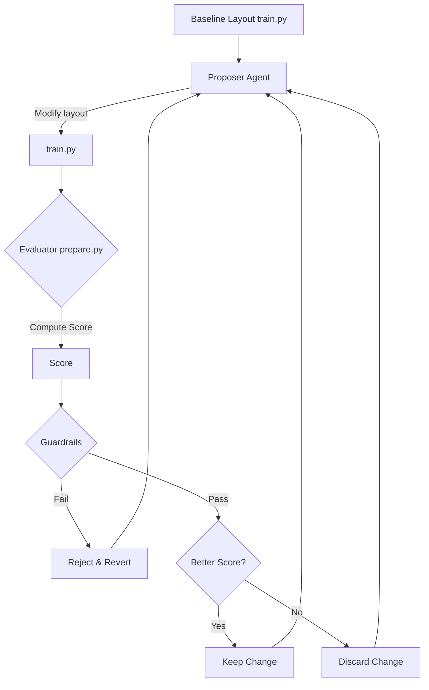

# PayPilot Layout Engine
### Autoresearch UI Agent for Payment Dashboards

Inspired by Andrej Karpathy’s original [autoresearch](https://github.com/karpathy/autoresearch) and extended using ideas from Langfuse’s [autoresearch writeup](https://langfuse.com/blog/2026-03-24-optimizing-ai-skill-with-autoresearch), this project applies the autoresearch loop to a new domain:

> **UI layout optimization for complex payment dashboards**

Instead of optimizing model training (`val_bpb`), this system optimizes **where features are placed on a dashboard**.

---

## 🧠 Core Idea

Payment dashboards are dense and operationally critical. They contain features like:

- Refunds  
- Payouts  
- Failed payments  
- Disputes  
- Risk alerts  
- Settlements  
- Analytics and exports  

The real problem is:

> **Where should each feature be placed so users can act faster, with fewer clicks, and without missing critical actions?**

This system solves that using an **autoresearch loop**:

- Propose a layout  
- Evaluate it using UI metrics  
- Enforce safety constraints  
- Keep only improvements  
- Repeat  

---

## 🔄 Autoresearch Loop (UI Version)



---

## 🏗️ Architecture (1:1 with Original Autoresearch)

To stay faithful to the original design, we preserve the same file structure and philosophy:

### 1. `prepare.py`
- Fixed evaluation harness  
- Computes UI score  
- Enforces safety guardrails  
- **Never modified by the agent**

---

### 2. `train.py`
- **The only file the agent edits**  
- Represents the dashboard layout  
- Maps features → UI zones  

👉 Equivalent to modifying model architecture in the original autoresearch

---

### 3. `program.md`
- Instruction file for the agent  
- Defines UI rules:
  - P0 features must be visible  
  - Minimize clicks for critical workflows  
  - Avoid cluttering the primary screen  

---

### 4. `launch.py`
- Supervisor loop  
- Runs the full cycle:
  - Triggers edits  
  - Executes evaluation  
  - Compares scores  
  - Accepts or reverts changes  
- Logs all runs to `result.csv`

### 📁 Project Structure

```
.
├── prepare.py      # evaluator (never edited)
├── train.py        # layout definition (agent edits this)
├── program.md      # agent instructions
├── launch.py       # optimization loop
├── result.csv      # iteration logs
```

---

## 📊 Evaluation Function

```
score =
  0.30 * task_success
+ 0.25 * speed
+ 0.20 * priority_alignment
- 0.10 * clutter_penalty
```

---

## 🚨 Guardrails (Critical for Payments)

This system enforces strict safety rules:

- P0 features must always be visible  
- Refunds, payouts, and disputes cannot be hidden  
- Critical actions must be reachable quickly  
- No layout can reduce operational visibility  

If violated → layout is **immediately rejected**

---

## ▶️ Run the System

```bash
python launch.py
```

---

## 📊 Output

- `train.py` → best layout found  
- `result.csv` → full optimization history  

---

## 🧬 Why This Matters

UI design is usually subjective.

This project makes it:

> **measurable, testable, and optimizable**

It connects:
- LLM agents  
- UI/UX design  
- Fintech dashboards  
- Continuous optimization loops  

---

## 🧠 Mental Model

| Layer | Role |
|------|------|
| PayPilot | Displays financial data |
| PayPilot Layout Engine | Decides feature placement |

---

## 📌 Summary

**PayPilot Layout Engine** applies autoresearch to UI systems.

> Instead of training models, it trains **dashboard layouts**.

It continuously improves feature placement based on usability, priority, and safety constraints.
