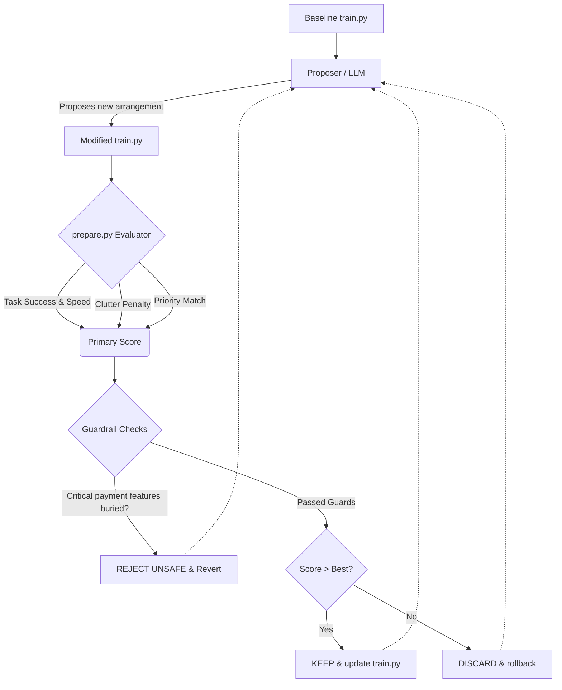
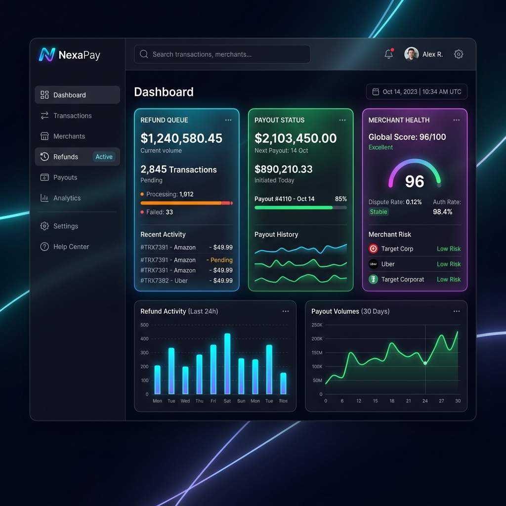

# Autoresearch UI Agent for Payment Dashboards

Inspired heavily by Andrej Karpathy's original [autoresearch](https://github.com/karpathy/autoresearch) pattern and Langfuse's [writeups](https://langfuse.com/blog/2026-03-24-optimizing-ai-skill-with-autoresearch), this project adapts the concept of self-optimizing LLM agents from evaluating PyTorch LLMs into evaluating **UI Layouts**.

This closed-loop system iteratively optimizes the feature placements for a Payment Operations dashboard. An agent proposes new layouts, an evaluator runs pseudo UI tests (scoring task success, speed, discoverability, safety), and a supervisor loop rejects the changes if they break critical payment workflows or accepts them if the UX metrics improve.

---

## 🏗️ Architecture

The architecture maps strictly 1:1 to the original Karpathy codebase rules to maintain a pure optimizer-evaluator separation:

1. **`prepare.py`**: Fixed constants and evaluation utilities. Handles the "UI test harness", scoring math, and safety guardrails. Never edited by the agent.
2. **`train.py`**: **The single file the agent edits.** Contains the dashboard layout data (the "model architecture"). Modifying this file changes how UI components (Refunds, Settlements, etc.) render into different dashboard zones.
3. **`program.md`**: The instruction file. Point your agent here. Contains the System Guidelines for Payment Ops prioritizing logic (`P0 features must be highly visible`). Human-editable.
4. **`launch.py`**: The supervisor loop. Points the agent to the file, triggers the edit, runs the code, captures the stdout `final_score`, and commits or reverts the `train.py` layout depending on guard limits. Logs everything to `result.csv`.

## 🔄 The Optimization Workflow

## 📊 Evaluation Metrics

Instead of `$val_bpb`, the target function maximizes the UI layout score based on concrete UX parameters:
- **Task Success**: Guaranteed if safety guardrails pass.
- **Speed**: Proximity of `P0` elements (Refunds, Failed Payments) to critical zones.
- **Priority Alignment**: Rewarding `P1` at top or second row, penalizing hidden items.
- **Discoverability (Clutter Penalty)**: Highly penalized if rare admin tools `P3` clutter the top screen real estate.
- **Safety**: **Hard Guardrail.** Failing to expose `P0` items correctly permanently invalidates the run (`REJECT_UNSAFE`).

## 🖼️ UI Optimization Outcome

When running `launch.py`, the continuous evaluation allows the script to discard unsafe layouts over dozens of runs, optimizing until reaching the strongest score possible without sacrificing regulatory safety rules. 

The resulting output represents a top-tier layout configuration that we simulated into the following UI Mockup:

*Final successful evaluation run configures `Refund queue` and `Payout status` to the `top_first_row` and `top_action_bar`, perfectly adhering to the ops rules.*
